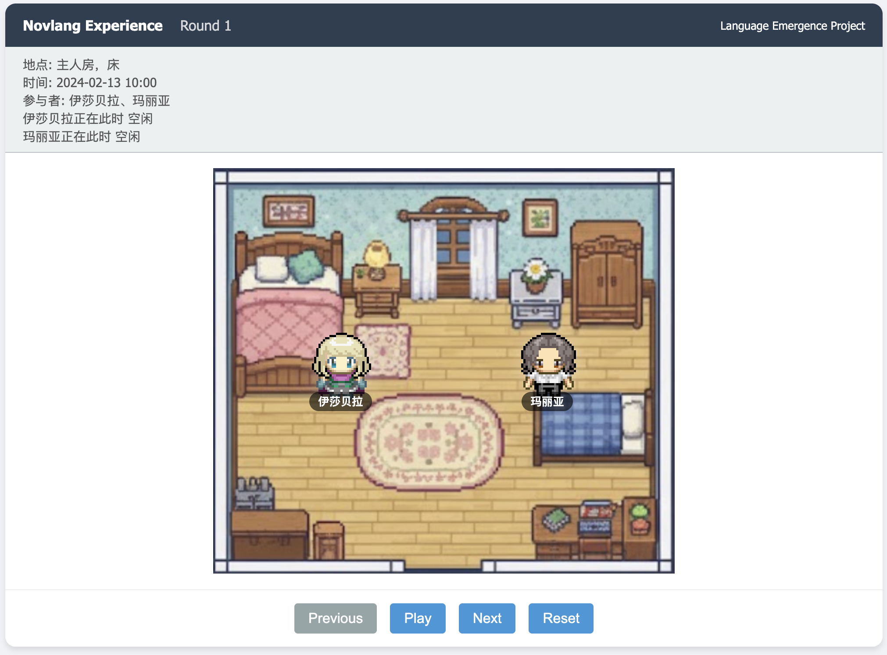

简体中文 | [English](./README_en.md)

# Anon Tokyo 的语言涌现实验

斯坦福AI小镇由斯坦福大学和谷歌于2023年8月开源，由25个智能体组成的虚拟世界，模拟了真实的人类生活。25个智能体完全由ChatGPT驱动，自主组织派对、参加会议、在情人节筹办各种活动。他们能够展现出与人类相似的生活模式和行为习惯。

我们对原论文的汉化改进版本[GenerativeAgentsCn](https://github.com/x-glacier/GenerativeAgentsCN.git)
进行了自己的重构，并进行了语言涌现的实验。


主要工作：


## 1. 准备工作

### 1.1 获取代码：

```
git clone https://github.com/fallsmoca/CoRe-Anon-Tokyo-Final-Project.git
cd CoRe-Anon-Tokyo-Final-Project
```

### 1.2 配置大语言模型（LLM）

修改配置文件 `generative_agents/data/config.json`:
1. 默认使用[Ollama](https://ollama.com/)加载本地量化模型，并提供OpenAI兼容API。需要先拉取量化模型（参考[ollama.md](docs/ollama.md)），并确保`base_url`和`model`与Ollama中的配置一致。
2. 如果希望调用其他OpenAI兼容API，需要将`provider`改为`openai`，并根据API文档修改`model`、`api_key`和`base_url`。

### 1.3 安装python依赖

建议先使用anaconda3创建并激活虚拟环境：

```
conda create -n anontokyo python=3.12
conda activate anontokyo
```

安装依赖：

```
pip install -r requirements.txt
```

检查环境与大模型：

```
cd generative_agents
python test_setup.py
python test_llm_format.py
```


## 2. 运行语言涌现实验

```
 python party_chat.py --name experiment --rounds 10 --turns 20 --group-interval 3 --inject-round 4
```

参数说明:
- `name` - 每次启动虚拟小镇，需要设定唯一的名称，用于实验结果记录。
- `rounds` - 总轮次。实验要运行多少轮对话（Round）。
- `turns` - 每轮的回合数。在一轮对话中，两个角色一来一回说多少句话。
- `group-interval` - 群聊频率。每隔多少轮（Round），触发一次“村庄广场多人共享对话”（所有角色聚在一起聊天）。
- `inject-round` - 插入外来词语的轮数，即在第几轮引入外来词语（可选）

p.s. 我们的demo存储在demo文件夹下的demo_new.html中，该文件夹下的generate_viz.py能将rounds.json改成demo的格式

这是我们的demo的一个截屏：

